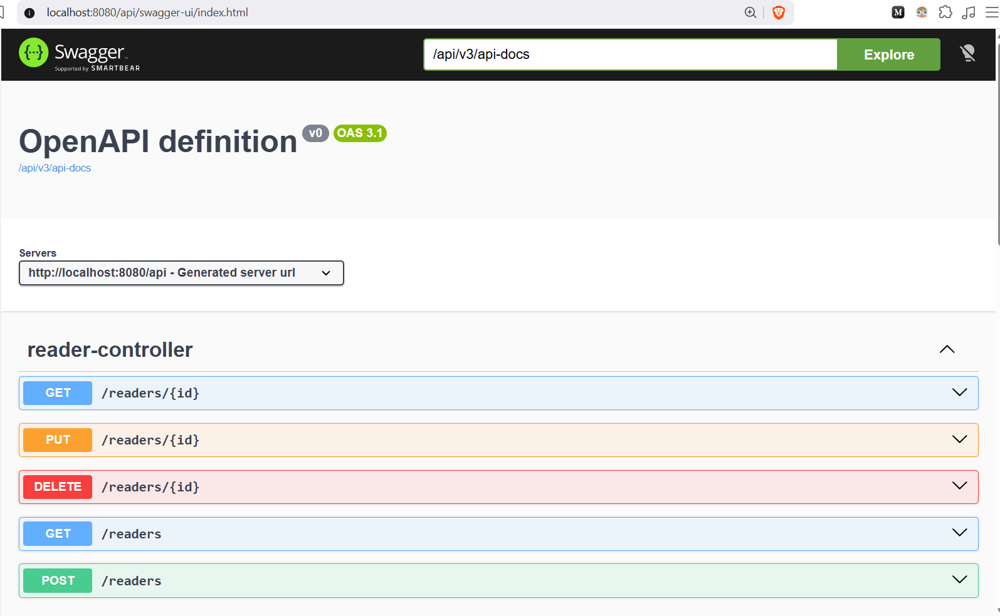
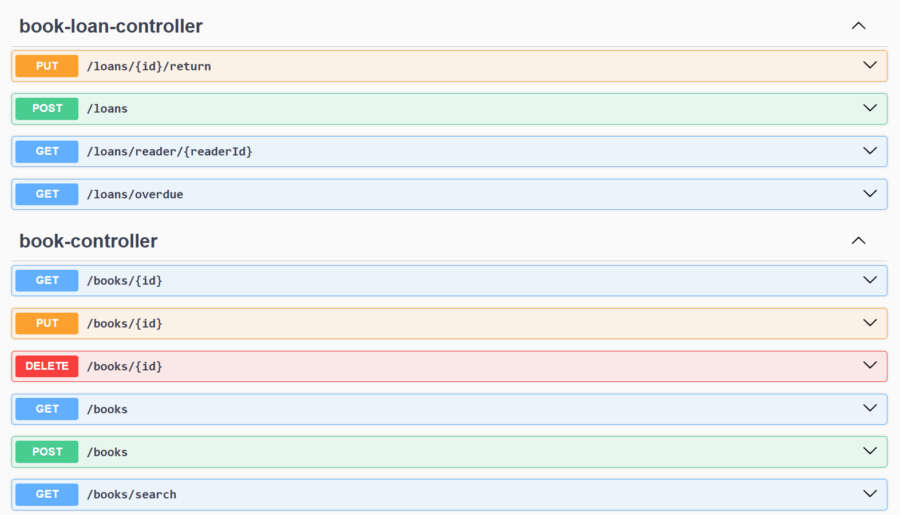

# 📚 Library Management System

A RESTful Library Management System built with **Java 21** and **Spring Boot 3**.

The application allows librarians to manage books, readers, and book loans while demonstrating modern backend development practices such as layered architecture, validation, database migrations, Docker, and automated testing.

---

# Features

* 📖 Book management (CRUD)
* 👤 Reader management (CRUD)
* 🔄 Borrow and return books
* 🔍 Search books using multiple filters
* ✅ Request validation
* ⚠️ Global exception handling
* 🗄️ PostgreSQL database
* 📜 Database versioning with Liquibase
* 🐳 Docker & Docker Compose support
* 🧪 Unit and integration testing with Testcontainers

---

# Tech Stack

| Technology      | Version |
| --------------- |---------|
| Java            | 21      |
| Spring Boot     | 4.1     |
| Spring Data JPA | Latest  |
| PostgreSQL      | 17      |
| Liquibase       | Latest  |
| Docker          | Latest  |
| Maven           | 3.x     |
| JUnit 5         | Latest  |
| Testcontainers  | Latest  |
| Lombok          | Latest  |

---

# Architecture

The project follows a layered architecture.

```
Client
   │
   ▼
Controller
   │
   ▼
Service
   │
   ▼
Repository
   │
   ▼
PostgreSQL
```

### Layers

* **Controller** – Handles HTTP requests and responses.
* **Service** – Contains business logic.
* **Repository** – Database access using Spring Data JPA.
* **Entity** – Database models.
* **DTO** – Request and response objects.
* **Validation** – Bean Validation for incoming requests.
* **Exception Handling** – Centralized error handling using `@RestControllerAdvice`.

---

# Project Structure

```
src
├── controller
├── dto
├── entity
├── exception
├── repository
├── service
├── validation
├── config
└── resources
    └── db.changelog
```

---

# Getting Started

## Clone the repository

```bash
git clone https://github.com/your-username/library-management.git

cd library-management
```

---

## Start PostgreSQL

```bash
docker compose up -d
```

---

## Run the application

```bash
mvn spring-boot:run
```

or

```bash
make run
```

---

## Build

```bash
mvn clean package
```

---

## Run Tests

```bash
mvn test
```

---

# Docker

Start containers

```bash
docker compose up -d
```

Stop containers

```bash
docker compose down
```

View logs

```bash
docker compose logs -f
```

---

# Database

This project uses:

* PostgreSQL
* Liquibase for schema migrations

Database migrations are executed automatically when the application starts.

---

# API

The application exposes REST APIs for managing:

* Books
* Readers
* Book Loans

If Swagger/OpenAPI is enabled, API documentation will be available at:

```
http://localhost:8080/api/swagger-ui/index.html
```




---

# Testing

The project contains:

* Unit Tests
* Service Tests
* Repository Tests
* Testcontainers for PostgreSQL

Run all tests:

```bash
mvn test
```

---

# Future Improvements

* OpenAPI Documentation
* Metrics with Micrometer
* JWT Authentication
* Role-Based Authorization
* Pagination
* Sorting

---

# License

This project is intended for learning and portfolio purposes.
